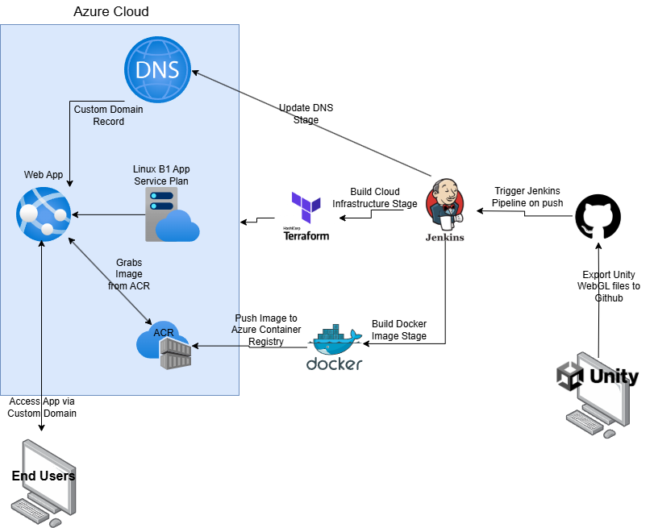

# Unity Endless Runner Web App
This project is a full-stack, cloud-native deployment example of how to deploy a Unity WebGL project using Azure's Web App service. It covers a wide array of technologies inlcuding Unity, Azure Cloud, Terraform, CI/CD pieplines, and serverless computing. Everything is designed with a high standard of security practices in mind.
---

## Technologies Used  
- Azure : Web Apps, App Service Plans, Azure Container Registry, Azure Hosted Zones
- Terraform: Infrastructure as Code Tool  
- Unity: Game Engine 
- Jenkins : For CI/CD 
- GitHub : Version Control
- Docker : For containerization of build files
- Nginx : Our webserver choice

---

## Useful Links
- [Terraform Azure Provider Documentation](https://registry.terraform.io/providers/hashicorp/azurerm/latest/docs)  
  Official resource for defining Azure infrastructure using Terraform.

- [Unity Documentation](https://docs.unity.com/en-us)  
  Docs and guides to work with the Unity ecosystem

- [Azure App Service Documentation](https://learn.microsoft.com/en-us/azure/app-service/)  
  Fully managed platform as a service for creating web applications.

- [Docker Docs](https://docs.docker.com/)  
  Learn Docker basics and the benefits of containerization.

- [Jenkins Documentation](https://www.jenkins.io/doc/)  
  Automate CI/CD pipelines to deploy infrastructure and sync content.

---

## Security & Best Practices

1. **Terraform backend**  
   If your working on this project with multiple people, I'd reccomend storing your terraform state remotly as well. Both Azure and AWS have solutions for doing so.
   [Store Terraform state in Azure Storage](https://learn.microsoft.com/en-us/azure/developer/terraform/store-state-in-azure-storage?tabs=azure-cli)
   [AWS S3 Bucket Backend](https://docs.aws.amazon.com/prescriptive-guidance/latest/getting-started-terraform/states-and-backends.html)

---
# Web App Architecture Diagram

---

## How-To Guide

### Step 1: GitHub and Terraform Setup  
Create a new GitHub repository to manage your source code with version control. Clone this repository locally to organize your Terraform files, scripts, and other resources. This repo will also integrate with Jenkins later for automated deployments. I've organized this into 3 folders: App (unity build files), Configs (JenkinsFile, DockerFile, nginx config), Infrastructure (terraform files).
**Note: Make sure you include a .gitignore for the .terraform directory**

---